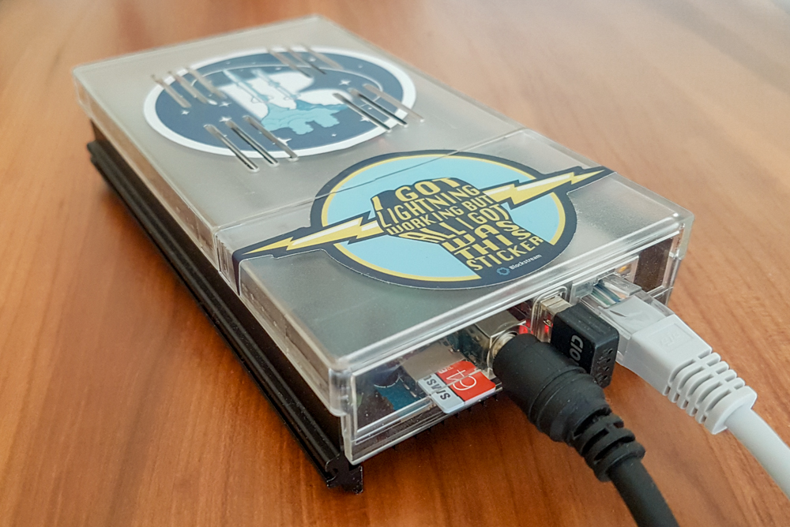

[ **Intro** ]--[ [Hardware](thundroid_01_hardware.md) ]--[ [Network](thundroid_02_network.md) ]--[ [Odroid](thundroid_03_odroid.md) ]--[ [Bash](thundroid_04_bash.md) ]--[ [Bitcoin](thundroid_05_bitcoin.md) ]--[ [Lightning](thundroid_06_lnd.md) ]--[ [Tor](thundroid_07_tor.md) ]--[ [Web Interface](thundroid_08_webinterface.md) ]--[ [Contact](thundroid_09_contact.md) ]

--------
### Jarosz's Expanded :zap:Thundroid:zap: Guide
--------

> [!WARNING]  
> Disclaimer: This guide was last updated in November 2018. Many things in it will likely be out of date now so proceed with caution and take everything with a grain of salt.

I've been telling myself for over a year that I'll set up a Bitcoin node, but I would always procrastinate. I don't have enough space left on my MacBook Pro, and the commonly and cheaply available RaspberryPi has several performance issues.

Then one day I saw Stadicus' article on Medium: ["The perfect Bitcoin Lightning node"](https://medium.com/@stadicus/perfect-low-cost-%EF%B8%8Flightning%EF%B8%8F-node-4c2f42a4ff7b). The photo of his Thundroid was oddly tantalizing, and I loved his choice of Odroid over RaspberryPi. The next thing I knew I was ordering an Odroid kit from South Korea. 

While Stadicus' guide was a great starting point, 

* I found myself craving explanations for the commands we were running (thank you Stackoverflow community for all the answers!).
* I quickly ran into technical issues not mentioned in the guide that had me stumpted for a while.
* I found that Stadicus was not very helpful when I emailed him about issues with his script.
* I found that the [Thundroid guide](https://medium.com/@stadicus/perfect-low-cost-%EF%B8%8Flightning%EF%B8%8F-node-4c2f42a4ff7b) was not as complete as the [RaspiBolt guide](https://github.com/Stadicus/guides/tree/master/raspibolt).
* I wanted to skip the testnet and jump right into the mainnet.
* I wanted to install Bitcoin's blockchain directly from my node (my laptop doesn't have enough space).
* I wanted to make tweaks to Stadicus' customizations (especially in Bash).
* I wanted to jump into bonus stuff like Tor and a web interface.

So with that in mind, I created my own guide. At first it was private and for my own use. I used it kind of like a journal of sorts to try to better understand what I was doing in Stadicus' guide, to document issues I ran into (and the solutions that worked), and to keep track of the tweaks I made. I later realized that this could be useful for other newbies to have access to, so I polished it up a bit and made it public.

Note: This guide assumes you're on MacOS and are somewhat comfortable with Terminal.

Enjoy :)