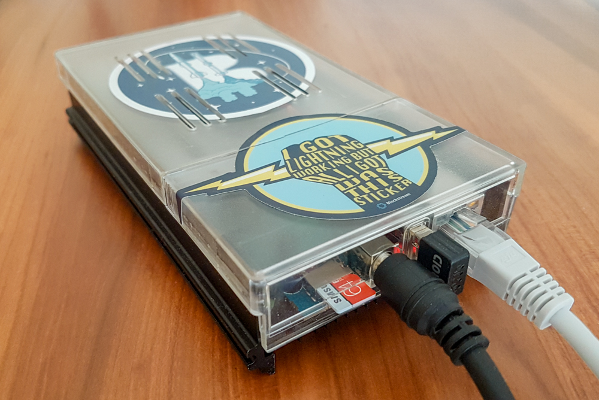
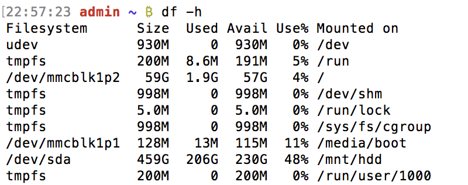

[ [Intro](README.md) ]--[ **Hardware** ]--[ [Network](thundroid_02_network.md) ]--[ [Odroid](thundroid_03_odroid.md) ]--[ [Bash](thundroid_04_bash.md) ]--[ [Bitcoin](thundroid_05_bitcoin.md) ]--[ [Lightning](thundroid_06_lnd.md) ]--[ [Tor](thundroid_07_tor.md) ]--[ [Web Interface](thundroid_08_webinterface.md) ]--[ [Contact](thundroid_09_contact.md) ]

--------
### Jarosz's Expanded :zap:Thundroid:zap: Guide
--------

# Shopping List

* External Storage (HDD/SSD)
  * 500 GB or more
  * SATA connection 
  * 3.5" HDD or 2.5" HDD/SSD
  * If you're buying it from scratch, definitely go with the SSD
* Internal Storage (MicroSD card)
  * 8 GB or more is enough to run all the software
  * In practice though, due to system logging files growing faster than they can be rotated, you might want to get 32 GB (it's still damn cheap)
  * Get adapter so you can plug it into your regular computer
* [Ethernet Cable CAT6](http://www.hardkernel.com/main/products/prdt_info.php?g_code=G1416375765180)
* optional: Wifi Module
  * [Wifi Module 0](http://www.hardkernel.com/main/products/prdt_info.php?g_code=G145431421052) if your Thundroid will be near your router.
  * Wifi Module [3](http://www.hardkernel.com/main/products/prdt_info.php?g_code=G137447734369)/[4](http://www.hardkernel.com/main/products/prdt_info.php?g_code=G141630348024)/[5](http://www.hardkernel.com/main/products/prdt_info.php?g_code=G147513281389) if your Thundroid will be far away from your router.

Now depending on whether you're planning to use a 3.5" HDD or a 2.5" HDD/SSD, you have two different shopping lists:

If using a 2.5" HDD or SSD | If using a 3.5" HDD
------------ | -------------
[Hardkernel's Odroid-HC1 (Home Cloud One)](http://www.hardkernel.com/main/products/prdt_info.php?g_code=G150229074080) | [Hardkernel's Odroid-HC2 (Home Cloud Two)](http://www.hardkernel.com/main/products/prdt_info.php?g_code=G151505170472)
[5V/**6**A power supply](http://www.hardkernel.com/main/products/prdt_info.php?g_code=G146977556615)<br/>(5V/4A is not enough to power an external HDD/SSD) | [12V/12A power supply](http://www.hardkernel.com/main/products/prdt_info.php?g_code=G151578376044)
 | 
optional: [Odroid-HC1 case](http://www.hardkernel.com/main/products/prdt_info.php?g_code=G150878897712) | optional: [Odroid-HC2 case](http://www.hardkernel.com/main/products/prdt_info.php?g_code=G151596669222)

I love the case because it's a great way to prevent your Thundroid from getting dusty and it's nice to decorate it. Also, if you're planning to keep your Thundroid in your bedroom, get the solid/dark case (if it's available) because the Odroid motherboard has a very bright blue blinking LED that will light up your ceiling. Or you can just disable the LED by reprogramming some settings (see next section).


### Bonus: Bitcoin stickers
You might also want to invest in some stickers to cover the top of the case and block out the blinking LED – or just to prettify your hardware :)

* [Blockstream's I Got Lightning Working](https://store.blockstream.com/product/lightning-sticker/)
* [PartyBrew's Bitcoin Moon](https://www.etsy.com/in-en/listing/582859688/bitcoin-moon-sticker-space-seal-sticker)



# Prepare the MicroSD Card

* Download **Ubuntu 16.04.03 LTE (Minimal, Bare OS)** that is provided by Hardkernel.<br/>
  https://wiki.odroid.com/odroid-xu4/os_images/linux/ubuntu_4.14/ubuntu_4.14
  * Exact file used: [ubuntu-16.04.3-4.14-minimal-odroid-xu4-20171213.img.xz](https://odroid.in/ubuntu_16.04lts/ubuntu-16.04.3-4.14-minimal-odroid-xu4-20171213.img.xz)
* Extract/unzip the Ubuntu file.
* Flash the Ubuntu file onto your MicroSD card using [Etcher](https://etcher.io/).


# Hardware Assembly

* Insert the SSD/HDD into the HC1/HC2.
* Flip the HC1/HC2 upside down and secure your SSD/HDD with the included screw.
* If you bought the plastic case, now is the time to slide it over the metal body of your HC1/HC2 (it has to be on before inserting anything else into the HC1/HC2's motherboard).
* Insert your flashed MicroSD card.
* Plug in the ethernet and power cables.
* The initial boot can take several minutes. SSH is on by default.

⚠️ Caution: If you ever want to take off the smaller half of the plastic case, be sure to first unplug the cables and remove the SD card. If you take off the plastic case with the SD card still inserted, the SD card might break.

<br/><br/>

--------
# Switching MicroSD Cards (for future reference)
Later on you, once you already have your Thundroid fully set up and running, you might want/need to upgrade your MicroSD card. 

To do this, you'll need to backup an image of your current MicroSD card and then use it to flash a new MicroSD card.

### Backing up your current MicroSD Card

* Shutdown your Thundroid.<br/>
  `sudo shutdown -h now`
* Unplug your Thundroid and remove the MicroSD card.
* Put the MicroSD card inside of an adapter and then insert it into your Mac.
* On your Mac, open Terminal and run this command to get a list of all the drives connected to your Mac.<br/>
  `diskutil list`
* You can identify your MicroSD card on the list by the size of its FDisk_partition_scheme. In my case, it's 8.0 GB. 


* Note down the location name of your MicroSD card. In my case, it's **/dev/disk2**.
* Save a backup of your MicroSD card onto your Mac's home directory. Replace '**disk2**' with the location name of your MicroSD card.<br/>
  `sudo dd if=/dev/disk2 of=~/sdcard.bin`
  * 'if' means input file. 
  * 'of' means output file. 
  * '~/' is the shortcut for your home directory.
  * 'sdcard.bin' is what we are naming the backup. You can also use a '.img' file type.
* Enter your Mac's password and wait for the backup process to finish (it can take as long as 30 minutes or more). Don't do anything else in the Terminal until you see a message similar to this:
```
15556608+0 records in
15556608+0 records out
7964983296 bytes transferred in 1830.774655 secs (4350608 bytes/sec)
```
* Eject the MicroSD card and put in the new one.

### Flashing your New MicroSD Card (METHOD A)

* Find out the location name of the new MicroSD card (it will likely be the same).<br/>
  `diskutil list`


* Unmount the new MicroSD card.<br/>
  `diskutil unmountDisk /dev/disk2`
* Copy the contents of your old MicroSD backup to your new MicroSD.<br/>
  `sudo dd if=~/sdcard.bin of=/dev/disk2`
* As before, this process can take 30 minutes or more (mine took almost an hour). Don't do anything else in the Terminal until you see a message similar to this:
```
15556608+0 records in
15556608+0 records out
7964983296 bytes transferred in 2988.589914 secs (2665131 bytes/sec)
```

### Flashing your New MicroSD Card (METHOD B)

* Instead of using Method A, you can flash the **sdcard.bin** file onto your new MicroSD using Etcher. It's much, much faster (only about 5-10 minutes).

### Repartitioning 

* Eject the newly flashed MicroSD card from your Mac and insert it into your Thundroid.
* Power on your Thundroid and then login as *admin* via SSH (as always).
* Switch to root.<br/>
  `su -`
* Install parted using apt (Advanced Packaging Tool).<br/>
  `sudo apt-get install parted`
* Run parted.<br/>
  `parted`
* Print all disks and their partitions.<br/>
  `print all`


* Switch to MicroSD (not your SSD/HDD!).<br/>
  `select /dev/mmcblk1`
* Resize the ext2 file system of your MicroSD.<br/>
  `resizepart 2`
* Warning: Partition /dev/mmcblk1p2 is being used. Are you sure you want to continue? Yes/No?.<br/>
  `yes` 
* End? [7964MB]?.<br/>
  `100%` (or select a custom size like `33GB`, `44000MB`, etc)
* Exit parted (Ctrl+C).
* You'll see this message: `Information: You may need to update /etc/fstab.`, but in our case there's no need to update fstab as far as I can tell (someone please correct me if I'm wrong).
* Restart your Thundroid.<br/>
  `sudo shutdown -r now`
* Wait a minute or two and log back in as *admin*.
* Check the filesystems on your MicroSD card.<br/>
  `df -h`


* You'll notice that the available space hasn't increased yet.
* Resize your main filesystem to 100%.<br/>
  `sudo resize2fs /dev/mmcblk1p2`
* OR: Resize to a custom size.<br/>
  `sudo resize2fs /dev/mmcblk1p2 44G` (note: no 'B' in '44G')
* Check the filesystems again. It should now be successfully updated.<br/>
  `dh -f`

