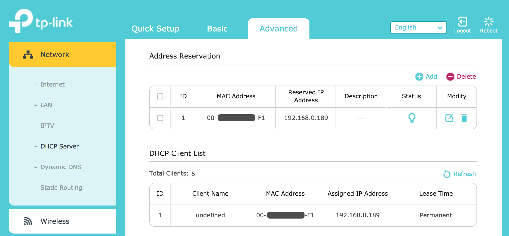
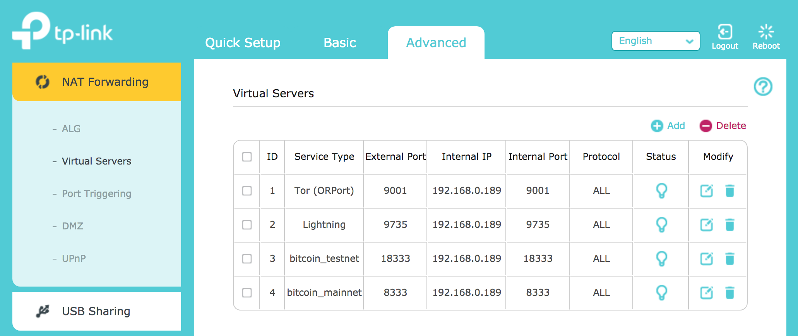

[ [Intro](README.md) ]--[ [Hardware](thundroid_01_hardware.md) ]--[ **Network** ]--[ [Odroid](thundroid_03_odroid.md) ]--[ [Bash](thundroid_04_bash.md) ]--[ [Bitcoin](thundroid_05_bitcoin.md) ]--[ [Lightning](thundroid_06_lnd.md) ]--[ [Tor](thundroid_07_tor.md) ]--[ [Web Interface](thundroid_08_webinterface.md) ]--[ [Contact](thundroid_09_contact.md) ]

--------
### Jarosz's Expanded :zap:Thundroid:zap: Guide
--------

Before we can work on our Thundroid, we need to change some network settings. If your router is getting old and you're thinking of buying a new one, now is the perfect time to do so. You'll want to have a router that is enjoyable to work with.

# Accessing Your Router
Most routers can be reached by typing this address into a browser: http://192.168.0.1/ (note: Http Secure will not work). The browser must be on a computer connected to your network.

If your router isn't at 192.168.0.1, try this guide here: [How to Find Your Default Gateway (Router)](http://www.noip.com/support/knowledgebase/finding-your-default-gateway/). Note for Mac: if connected to Wifi instead of ethernet, you'll need to select the "Advanced" settings and then go to the "TCP/IP" tab.

You'll need to signin to your router in order to change your network settings. Don’t know your router password? Try [routerpasswords.com](http://routerpasswords.com/). **If your router still uses the initial password: change it ASAP!**

# Fixed IP Address
In order to easily work with your Thundroid, you need to give it a fixed/static/reserved IP address. 

Look at all the devices connected to your home network and identify the IP address of your Odroid. Copy this address. Then go into the **DCHP settings** of your router and make your Odroid's current IP address fixed/static/reserved.

# Port Forwarding
Our Thundroid will be behind two firewalls: 
1. the first is on the router
2. the second is on the Thundroid itself (we'll be installing UFW Uncomplicated Firewall)

For programs on your Thundroid to work properly, you'll need to open ports on BOTH firewalls.

Below are the settings you need to add to your router. We'll look at UFW settings in the next section.

Make sure the IP in the Port Forwarding settings matches the fixed IP we set in the last section.

The **9001** port is optional. Only open it if you plan to support Tor on your Thundroid.