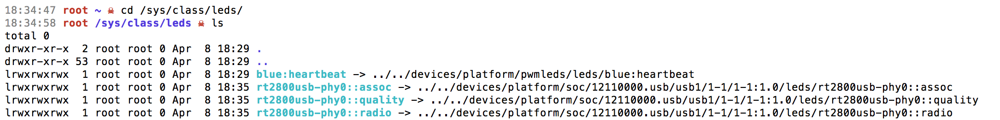
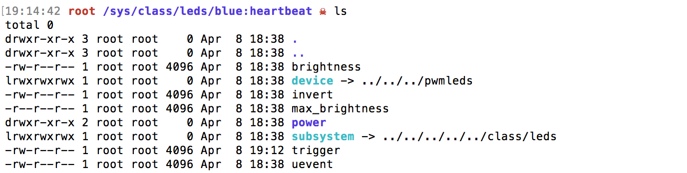

[ [Intro](README.md) ]--[ [Hardware](thundroid_01_hardware.md) ]--[ [Network](thundroid_02_network.md) ]--[ **Odroid** ]--[ [Bash](thundroid_04_bash.md) ]--[ [Bitcoin](thundroid_05_bitcoin.md) ]--[ [Lightning](thundroid_06_lnd.md) ]--[ [Tor](thundroid_07_tor.md) ]--[ [Web Interface](thundroid_08_webinterface.md) ]--[ [Contact](thundroid_09_contact.md) ]

--------
### Jarosz's Expanded :zap:Thundroid:zap: Guide
--------

# Project Passwords
Below are the passwords you'll need to create for your Thundroid:

```
[A] root & admin user password
[B] bitcoin user password
[C] Bitcoin RPC password
[D] LND wallet password
[E] LND seed password (optional)
```
All passwords should be at least 12 characters in length. Use a mix of lower and upper caps, numbers, and special characters. But do NOT use uncommon special characters, blanks, or quotes (‘ or “).

Note:
* Passwords [A], [B], and [D] you'll be using A LOT, so make them something easy to remember yet still secure.
* Password [C] just sits in a config file, so it's fine to generate it using LastPass (LastPass generated passwords are very secure but also very hard to type and remember).
* Password [E] you'll only use if you need to recover your LND wallet.

Also, you'll be given a 24 word seed for your LND wallet that you'll need to write down and store in a safe place somewhere.

### Password Management
I recommend using [LastPass](https://lastpass.com/f?6752706) to save and manage passwords. I personally don't consider paper notes to be safe or secure if you live with other people, unless you have a safe box -- but even then, ask yourself honestly if would you actually store the password sheet in the safe box, or keep it somewhere more convenient but less secure? There's also the risk of losing paper passwords in natural disasters like floods or fires. And if you're a digital nomad and don't have a permanent residence, keep in mind that passwords written in a physical document are subject to search when crossing international borders. Phones are also subject to search, but you can always uninstall your LastPass app before travelling and recover it later.

But there are those who think digital password storage is still more risky. You'll have to do your own research, balance risk and convenience based on your living situation, and then make your own decision.

I've taken a middle approach: passwords in LastPass, and LND wallet seed on paper (stored inside of a fire-proof safe box). 


# Basic Configuration

### Connect to your Odroid

* Connect using SSH and the fixed IP you set up in the Network section. Note: Windows users need [PuTTY](https://www.putty.org/) to get SSH to work (lol Windows users).<br/>
  `ssh root@192.168.0.189`
* The default password for *root* is "odroid".<br/>
* Change *root* password to password [A].<br/>
  `passwd`

### Time Zone & Localization

* Set time zone.<br/>
  `dpkg-reconfigure tzdata`
* Generate locale.<br/>
  `locale-gen en_US.UTF-8`
* Set locale.<br/>
  `dpkg-reconfigure locales`
* Generate the */etc/default/locale* file.<br/>
  `update-locale LC_ALL=en_US.UTF-8 LANG=en_US.UTF-8`
* Restart the system, or open a new terminal.<br/>
  `shutdown -r now`
* Confirm that your chosen locales are successfully installed.<br/>
  `locale -a`

### Software Updates

* Find updates.<br/>
  `apt update`
* Install updates.<br/>
  `apt upgrade`
* If you get this message:
```
The following packages were automatically installed and are no longer required
```
* Then run this command:<br/>
  `apt autoremove`
* Note: instead of `apt upgrade`, you can run `apt full-upgrade` (aka `apt dist-upgrade`).<br/>
  * `apt upgrade` will not change WHAT is installed (only installs new versions).
  * `apt full-upgrade` will install or remove packages as necessary to complete the upgrade.
* Install **linux-image-xu3**.<br/>
  `apt install linux-image-xu3`
* Answer [y], then [no] (do not abort).
* If you see errors like the ones below, it means that your locale configuration wasn't done properly.

```
perl: warning: Please check that your locale settings:
    LANGUAGE = (unset),
    LC_ALL = (unset),
    LANG = "en_CA.UTF-8"
    are supported and installed on your system.
perl: warning: Falling back to the standard locale ("C").
```

* Install some additional software (htop, git, curl, bash-completion, and jq).<br/>
  `apt install htop git curl bash-completion jq`
* Disable swap file (the usage of a swap file can degrade your MicroSD card very quickly).<br/>
  `swapoff —all`

### Naming our Odroid

* Using Nano text editor, open these two host files and change the hostname in each (replace "odroid" with “thundroid”).<br/>
  `nano /etc/hostname`
  `nano /etc/hosts`
  * Use Ctrl+O to confirm or change filename (& press enter).
  * Use Ctrl+X to Exit.

### User Management
For the initial configuration we're logged in as *root* user. In the future, we'll only be logging in as *admin* user. As *admin*, you'll need to add "sudo" before important commands (like the ones above) for them to work.

* Create user *admin*.<br/>
  `useradd -m admin`
* Give *admin* sudo powers.<br/>
  `adduser admin sudo`
* Change *admin*'s password to password [A].<br/>
  `passwd admin`
* Create user *bitcoin*.<br/>
  `useradd -m bitcoin`
* Change *bitcoin*'s password to password [B].<br/>
  `passwd bitcoin`

### Mounting the SSD/HDD

* Get the NAME of the main partition on the external SSD/HDD.<br/>
  `lsblk -o UUID,NAME,FSTYPE,SIZE,LABEL,MODEL`
* Format the external SSD/HDD (use [NAME] from above, e.g /dev/sda1).<br/>
  `mkfs.ext4 /dev/[NAME]`
* Copy the UUID for the SSD/HDD.<br/>
  `lsblk -o UUID,NAME,FSTYPE,SIZE,LABEL,MODEL`
* Open fstab file in Nano editor .<br/>
  `nano /etc/fstab`
* Paste this line at the end of fstab (**be sure to replace the UUID with your own**).<br/>
```
UUID=b27dbaa1-6809-45d1-89dd-e3b700b46074 /mnt/hdd ext4 noexec,defaults 0 0
```
* Save & close the file using Ctrl+X (then 'y', then 'enter').
* Create mount point for the SSD/HDD.<br/>
  `mkdir /mnt/hdd`
* Mount all filesystems.<br/>
  `mount -a`
* Check the SSD/HDD.<br/>
  `df /mnt/hdd`
```
Filesystem     1K-blocks      Used Available Use% Mounted on
/dev/sda       480590568 215479124 240675732  48% /mnt/hdd
```
* Set ownership of the SSD/HDD to *bitcoin* user.<br/>
  `chown bitcoin:bitcoin /mnt/hdd/`
* Make sure *admin* uses bash as standard shell.<br/>
  `sudo chsh admin -s /bin/bash`
* If you get this error, just restart your Thundroid, log back in as *root*, and run the command again.
```
sudo: unable to resolve host odroid
```
* Restart your Thundroid.<br/>
  `shutdown -r now`


# Security
Since your Thundroid will handle real money, it needs to be super-secure. Login as *admin* (we will avoid using *root* from now on unless absolutely necessary).

`ssh admin@192.168.0.189` (remember to update the IP address to your own)

### Fail2Ban
Fail2ban monitors SSH login attempts and bans a remote peer after 5 unsuccessful tries for 10 minutes. This makes a brute-force attack unfeasible, as it would simply take too long.

* Install fail2ban.<br/>
  `sudo apt install fail2ban`

### Uncomplicated FireWall (UWF)
Your Thundroid will be visible from the internet and therefore needs to be secured against attacks. A firewall controls what traffic is permitted and closes possible security holes.

We will configure our firewall to deny all connection attempts from other peers by default and allow only specific ports to be used.

* Change session to *root*.<br/>
  `sudo su`
* Install UFW.<br/>
  `apt install ufw`
* Add rules for UFW to follow.<br/>
  `ufw default deny incoming`<br/>
  `ufw default allow outgoing`<br/>
  `ufw allow from 192.168.0.0/24 to any port 22 comment 'allow SSH from local LAN'`
  * Assuming the IP address of your Pi is something like 192.168.0.xxx (the xxx being any number from 0 to 255). 
  * If your IP address is different, like 12.34.56.xxx, you must modify this line to `ufw allow from 12.34.56.0/24`.
  * Note: the number before `/24` must be 0, regardless of your IP address!

  `ufw allow 8333 comment 'allow Bitcoin mainnet'`<br/>
  `ufw allow 18333 comment 'allow Bitcoin testnet'`<br/>
  `ufw allow 9735 comment 'allow Lightning'`

* If you're planning to use your Thundroid as a Tor Middle Relay, add this extra rule:<br/>
  `ufw allow 9001 comment 'allow ORPort (Tor Middle Relay)'`
* Enable UFW.<br/>
  `ufw enable`<br/>
  `systemctl enable ufw`
* Check to see if all the rules were recorded correctly.<br/>
  `ufw status`
* Exit *root* session and return back to *admin*.<br/>
  `exit` (or press Ctrl+D)

### SSH Keys
One of the best options to secure the SSH login is to completely disable the password login and require a SSH key certificate. Only someone with physical possession of the private key can login.

On your Mac:

* Create a RSA key pair.<br/>
  `ssh-keygen -t rsa`
* "Enter file in which to save the key:"<br/>
  `thundroid_rsa`
* "Enter passphrase:" (optional)

On your Thundroid:

* Login as normal.<br/>
  `ssh admin@192.168.0.189`
* Make sure you are in your admin's home folder (the `cd` command will take you there if you are not).<br/>
  `cd`
* Create a directory for SSH.<br/>
  `mkdir .ssh`
* Create a file to keep track of authorized keys.<br/>
  `nano .ssh/authorized_keys`
  * Paste the content from the Public Key file.
  * Save & close the file (Ctrl+X).
* Protect the SSH folder and authorized_keys file with 700 permissions (only owner can read, write, and execute).<br/>
  `chmod -R 700 .ssh/`
* Disconnect from your Thundroid.<br/>
  `exit` (or press Ctrl+D)
* Login to *admin* again, but this time using your SSH key.<br/>
  `ssh admin@192.168.0.189 -i /Users/jarosz/.ssh/thundroid_rsa`
  * Be sure to use the file location of your own public key.
* If you can login to *admin* with your SSH key, disable password login.<br/>
  `sudo nano /etc/ssh/sshd_config`
  * Change ChallengeResponseAuthentication to "no".
  * Uncomment PasswordAuthentication.
  * Change PasswordAuthentication to "no".
  * Save & close the file. (Ctrl+X)
* Copy the SSH public key to *root* user, just in case.<br/>
  `sudo mkdir /root/.ssh`<br/>
  `sudo cp /home/admin/.ssh/authorized_keys /root/.ssh/`<br/>
  `sudo chown -R root:root /root/.ssh/`<br/>
  `sudo chmod -R 700 /root/.ssh/`<br/>
  `sudo systemctl restart sshd.service`
* Exit (Ctrl+D).
* Try to login **without** your SSH key to make sure it's working properly. 
* You should only be able to login with *admin* or *root* and your SSH key. 

⚠️ Backup your SSH key from your Mac -- copy it onto a USB and lock it in a safe. There is no fallback login if you lose your SSH key!

Worst case scenario: you'll need to flash the MicroSD card and set up the system again. But luckily all important stuff is on the HDD/SSD and won't be affected :)


# Auto-Update
To keep your system secure and bug-free, you need to make sure that your Ubuntu packages are regularly updated.

We're going to create an update script and have it automatically run every week.

* Change session to *root* user.<br/>
  `sudo su`
* Create an `auto-update` file using Nano editor in the `cron.weekly` folder.<br/>
  `nano /etc/cron.weekly/auto-update`
* Paste the following instructions:<br/>
```
#!/bin/bash
apt update
apt upgrade -y
apt autoclean
```
* Save & close the file. (Ctrl+X)
* Make the file executable in order for cron to be able to run it.<br/>
  `chmod 755 /etc/cron.weekly/auto-update`
  * `chmod` sets file permissions.
  * `755` means full permissions for the owner (rwx) and read and execute permission for others (rx).
* Logout from *root* (Ctrl+D).

You are finished :) The cron job will run weekly and:

* update your source list (to see if there are any new package updates), 
* update your packages as found and needed, and
* clean out any old unused packages no longer installed after updating. 

⚠️ Note: you'll still need to manually update your Bitcoin Core and LND clients.

### Bonus: Auto-Update w/ IFTTT Notification
If you want to be notified when your Ubuntu system is updated and whether it was successful or not, use this script instead of the one above.

For notifications, you'll need an [IFTTT Webhooks key](https://ifttt.com/maker_webhooks) and the following IFTTT Applet setup:

* If Maker Event "thundroid_updated", then Send me an email at example@example.com
* Event name: `thundroid_updated`
* Subject: `Thundroid update was {{Value1}}`
* Body: blank

Then as *root* user:

* Remove the previous `auto-update` file.<br/>
  `rm /etc/cron.weekly/auto-update`
* Create an `autoupdate.sh` file using Nano editor in the `cron.weekly` folder.<br/>
  `nano /etc/cron.weekly/autoupdate.sh`
* Paste the following script AND add your webhooks key!<br/>

```
#!/bin/bash
# This script will update your Ubuntu system every week,
# and informs you via IFTTT webhooks if the update was successful or not. 
# Place this script in /etc/cron.weekly/autoupdate.sh

# Set the variable for your IFTTT webhooks key.
webhooks_key="paste_your_key_here"                # <-PASTE YOUR KEY!

# Create a temporary path in /tmp to write a temporary log file. No need to edit.
updatelog=$(mktemp)

# Run the commands to update the system and write the log file at the same time.
echo "apt update" >> ${updatelog}
apt update >> ${updatelog} 2>&1
echo "" >> ${updatelog}
echo "apt upgrade" >> ${updatelog}
apt upgrade -y >> ${updatelog} 2>&1
echo "" >> ${updatelog}
echo "apt autoclean" >> ${updatelog}
apt autoclean >> ${updatelog} 2>&1

# Make IFTTT post call to give status of the update.
if grep -q 'E: \|W: ' ${updatelog} ; then
        curl --data "value1=FAIL" https://maker.ifttt.com/trigger/thundroid_updated/with/key/${webhooks_key}/
else
        curl --data "value1=successful ⚡" https://maker.ifttt.com/trigger/thundroid_updated/with/key/${webhooks_key}/
fi

# Remove the temporary log file in temporary path.
rm -f ${updatelog}
```

* Save & close the file. (Ctrl+X)
* Give `autoupdate.sh` execution privileges.<br/>
  `chmod 755 /etc/cron.weekly/autoupdate.sh`
* Run the script to see if it works. It may take a minute or two.<br/>
  `/etc/cron.weekly/autoupdate.sh`
* Logout from *root* (Ctrl+D).


# Extras

### Add Safe Shutdown Script (recommended for HDD)
The Odroid manufacturer recommends applying the following script to park your hard drive for a safe shutdown. 

If you are using an SSD instead of an HDD, this does **not** apply to you.

As user *admin*:

* Create a downloads directory (if you haven't already).<br/>
  `mkdir /home/admin/downloads`
* Enter the downloads directory.<br/>
  `cd downloads`
* Download the Safe Shutdown script.<br/>
  `wget https://dn.odroid.com/5422/script/odroid.shutdown`
* Check the contents of the script (it should look like what's shown below).<br/>
  `cat odroid.shutdown`

```
#!/bin/bash
exec </dev/null </dev/null 2>/dev/null
export LANG=C LC_ALL=C
# In all cases, we want the media to be in quiescent, clean state.
sync
[ -x /sbin/mdadm ] && /sbin/mdadm --wait-clean --scan
# Function used to park all SATA disks.
function ParkDisks() {
    if [ -x /sbin/hdparm ]; then
        Wait=0
        for Dev in /sys/block/sd* ; do
            [ -e $Dev ] && /sbin/hdparm -y /dev/${Dev##*/} && Wait=2
            sleep $Wait
            echo 1 > /sys/class/block/${Dev##*/}/device/delete
        done
        sleep $Wait
    fi
}
case "$1" in
    # reboot|kexec)
        # Do not park disks when rebooting or switching kernels.
    #     ;;
    *)
        ParkDisks
        ;;
esac
```

* Install the script.<br/>
  `sudo install -o root -g root -m 0755 ./odroid.shutdown /lib/systemd/system-shutdown/odroid.shutdown`


### Connect to your Odroid outside of your home network (optional)
You may want or need to work on your Odroid when you are away from your home network/router. In order to do this, you'll need to keep track of your router's public IP address and open port 22 for SSH. Be aware though that this exposes your Odroid to more attackers.

* On your router, open Port 22. Refer back to the "Port Forwarding" instructions in the Network page if you need to.
  * Service type: `SSH`
  * External & internal port: `22`
  * Protocol: `TCP`
  * Internal IP: same as before (the fixed IP we set for our Odroid)

* On your Odroid, as *root* user, open Port 22. Refer back to the "Uncomplicated FireWall" instructions on this page if you need to.<br/>
  `ufw allow 22 comment 'allow SSH from anywhere'`

* You can now login to your Odroid from anywhere in the world. Just replace the `ROUTER_EXTERNAL_IP` and `SSH_KEY_LOCATION` values in the following command.<br/>
  `ssh admin@ROUTER_EXTERNAL_IP -i SSH_KEY_LOCATION`

This is not much different from before. Instead of using our Odroid's internal IP, we are now just using our Router's external IP.

Note: the external IP of a your home network/router can change from time to time. So if suddenly you can no longer login using the above command, you might just need to update the external IP in the command. I personally love TP-link routers because they have a mobile app from which you can see up-to-date stats on your home router (like it's current external IP) from anywhere in the world.


### LED Settings (optional)
The Odroid has a very bright blue blinking LED that will light up your ceiling. If you keep your Odroid in your bedroom, this can be very annoying at night when you're trying to fall asleep.

Here's how you can permanently turn off the blinking blue LED:

* Login as *admin* user.
* Open the `/etc/rc.local` file using Nano editor.<br/>
  `sudo nano /etc/rc.local`
* Paste this line before `exit 0`.<br/>
```
echo none > /sys/class/leds/blue:heartbeat/trigger
```
* Save & close the file. (Ctrl+X)
* Restart your odroid.<br/>
  `sudo shutdown -r now`

<br/>
If you want to learn more about how LEDs work on Odroid, here are some useful commands. 

* Switch to *root* user. It's needed to change LED settings like `trigger`. (Using `sudo` as *admin* doesn't work).<br/>
  `su -`
* View a list of LEDs on your Odroid.<br/>
  `cd /sys/class/leds`<br/>
  `ls`<br/>
  * Note: it does not appear to show the red power LED, the yellow/orange ethernet LED, or the green blinking LED.
  * You'll see `rt2800usb-phy0::assoc`, `rt2800usb-phy0::quality`, `rt2800usb-phy0::radio`, but their triggers are set to `none` (off) so I'm not sure what they are for.



* Change into the directory that represents the blue LED.<br/>
  `cd /sys/class/leds/blue:heartbeat`
* View a list of all supported LED modes (for the LED whose directory you're in), and the LED mode that is currently used [heartbeat].<br/>
  `cat trigger`
```
none rc-feedback kbd-scrolllock kbd-numlock kbd-capslock kbd-kanalock kbd-shiftlock kbd-altgrlock kbd-ctrllock kbd-altlock kbd-shiftllock kbd-shiftrlock kbd-ctrlllock kbd-ctrlrlock mmc0 mmc1 [heartbeat] rfkill-any rfkill0 phy0rx phy0tx phy0assoc phy0radio 
```

* LED modes explained:
  * **heartbeat**: The default mode. It blinks like a heartbeat when the kernel is active. The frequency of the beat depends on CPU load.
  * **none**: Deactivates the LED completly.
* Change LED mode.<br/>
  `echo [name of LED mode] > trigger`
* If you want to make any `trigger` settings permanent, you have to include them in the `/etc/rc.local` file. 

Note: the HC1/HC2's blue LED does not appear to have many customization options. For example, if you run `ls` inside the `/sys/class/leds/blue:heartbeat` directory, you won't see `delay_on` and `delay_off` options. Also, `max_brightness` is not editable, and `trigger` is missing some common options like `torch`. 

Instead of turning off the blue LED, I would have preferred to reduce its brightness and slow down its blink speed (or just make it stay on without any blinking) -- but unfortunately none of these seem possible on a HC1/HC2. If I'm wrong, please let me know!



Further reading: [LED handling under Linux](https://github.com/hardkernel/linux/blob/odroid-3.8.y/Documentation/leds/leds-class.txt).


### Public IP Script (ARCHIVE)
In LND v0.4 (and earlier), we had to announce our public IP address to the Lightning network, which required us to first get it from a source outside of our network. 

Below is a script that checks our device's IP every 10 minutes (600 seconds) and stores it locally.

Note: this is no longer needed for LND v0.4.1 and above.

As *admin* user:

* Create script `getpublicip.sh`.<br/>
  `sudo nano /usr/local/bin/getpublicip.sh`

* Paste the following into `getpublicip.sh`:
```
#!/bin/bash
# getpublicip.sh
echo 'getpublicip.sh started, writing public IP address every 10 minutes into /run/publicip'
while [ 0 ]; 
    do 
    printf "PUBLICIP=$(curl -vv ipinfo.io/ip 2> /run/publicip.log)\n" > /run/publicip;
    sleep 600
done;
```

* Save & close the file. (Ctrl+X)

* Make the script executable.<br/>
  `sudo chmod +x /usr/local/bin/getpublicip.sh`

* Create the corresponding systemd unit.<br/>
  `sudo nano /etc/systemd/system/getpublicip.service`

```
[Unit]
Description=getpublicip.sh: get public ip address from ipinfo.io
After=network.target

[Service]
User=root
Group=root
Type=simple
ExecStart=/usr/local/bin/getpublicip.sh
Restart=always
RestartSec=600
TimeoutSec=10

[Install]
WantedBy=multi-user.target
```

* Save & close the file. (Ctrl+X)

* Enable systemd startup.<br/>
  `sudo systemctl enable getpublicip`<br/>
  `sudo systemctl start getpublicip`<br/>
  `sudo systemctl status getpublicip`

* Check if data file has been created (and view your public IP).<br/>
  `cat /run/publicip`