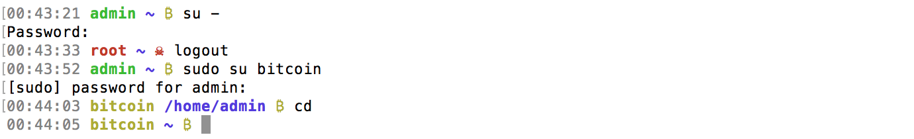
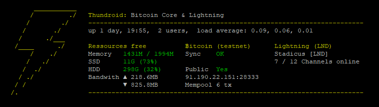

[ [Intro](README.md) ]--[ [Hardware](thundroid_01_hardware.md) ]--[ [Network](thundroid_02_network.md) ]--[ [Odroid](thundroid_03_odroid.md) ]--[ **Bash** ]--[ [Bitcoin](thundroid_05_bitcoin.md) ]--[ [Lightning](thundroid_06_lnd.md) ]--[ [Tor](thundroid_07_tor.md) ]--[ [Web Interface](thundroid_08_webinterface.md) ]--[ [Contact](thundroid_09_contact.md) ]

--------
### Jarosz's Expanded :zap:Thundroid:zap: Guide
--------

Since you'll be working on your Thundroid entirely via the shell prompt, it's worth decorating it a bit and installing some shortcuts. 

Run all of the commands below as *admin* user (unless instructed otherwise).

# Prettifying your Shell Prompt (optional)
You can redesign your shell prompt for each user by enabling color output and setting a custom prompt.

We're going to make *root* user be red, *admin* user be green, and *bitcoin* user be yellow.



### Admin user
* Open *admin*'s .bashrc file inside of nano editor.<br/>
  `nano /home/admin/.bashrc`
* Paste the following settings in the file:

```
# Enable color prompt
force_color_prompt=yes

# Colors
RED="\[\e[31m\]"
GREEN="\[\e[32m\]"
YELLOW="\[\e[33m\]"
BLUE="\[\e[34m\]"
MAGENTA="\[\e[35m\]"
CYAN="\[\e[36m\]"
LIGHT_GRAY="\[\e[37m\]"
DARK_GRAY="\[\e[90m\]"

# Formatting
RESET="\[\e[0m\]"
BOLD="\[\e[1m\]"

# Symbols
BTC="\342\202\277" # UTF-8 octal code for BTC symbol (U+20BF)
LND="\342\232\241" # UTF-8 octal code for Lightning symbol (U+26A1)

# Escape sequences (guide for newbies)
#  \[...\] = non-printable sequences should be wrapped in this
#  \e = \033 = escape character
#  \t = time
#  \u = username
#  \w = current directory
#  \n = new line

# Prompt design
PS1="${DARK_GRAY}\t ${debian_chroot:+($debian_chroot)}${BOLD}${GREEN}\u ${BOLD}${BLUE}\w ${RESET}${YELLOW}${BTC} ${RESET}"

# Aliases
# Set "ls" to always use the -la option
alias ls='ls -la --color=always'
```
* Save & close the file using Ctrl+X (then 'y', then 'enter').
* Reload *admin*'s .bashrc file so that the changes take effect (or just wait until next login).<br/>
  `source /home/admin/.bashrc`

### Bitcoin user
* Open *bitcoin*'s .bashrc file inside of nano editor (note: since we are editing *bitcoin* user's .bashrc file while being logged in as *admin* user, we need to add `sudo` to the command).<br/>
  `sudo nano /home/bitcoin/.bashrc`
* Paste the following settings in the file:

```
# Enable color prompt
force_color_prompt=yes

# Colors
RED="\[\e[31m\]"
GREEN="\[\e[32m\]"
YELLOW="\[\e[33m\]"
BLUE="\[\e[34m\]"
MAGENTA="\[\e[35m\]"
CYAN="\[\e[36m\]"
LIGHT_GRAY="\[\e[37m\]"
DARK_GRAY="\[\e[90m\]"

# Formatting
RESET="\[\e[0m\]"
BOLD="\[\e[1m\]"

# Symbols
BTC="\342\202\277" # UTF-8 octal code for BTC symbol (U+20BF)
LND="\342\232\241" # UTF-8 octal code for Lightning symbol (U+26A1)

# Prompt design
PS1="${DARK_GRAY}\t ${debian_chroot:+($debian_chroot)}${BOLD}${YELLOW}\u ${BOLD}${BLUE}\w ${RESET}${YELLOW}${BTC} ${RESET}"

# Aliases
# Set "ls" to always use the -la option
alias ls='ls -la --color=always'
```
* Save & close the file (Ctrl+X).
* Reload *bitcoin*'s .bashrc file so that the changes take effect (or just wait until next login)<br/>
  `source /home/bitcoin/.bashrc`

### Root user
* Switch to root user.</br>
  `su -`
* Backup the original .bashrc file.</br>
  `mv /root/.bashrc /root/.bashrc-backup`
* Create a new .bashrc file.</br>
  `nano /root/.bashrc`
* Paste the following settings in the file:

```
# Enable color prompt
force_color_prompt=yes

# Colors
RED="\[\e[31m\]"
GREEN="\[\e[32m\]"
YELLOW="\[\e[33m\]"
BLUE="\[\e[34m\]"
MAGENTA="\[\e[35m\]"
CYAN="\[\e[36m\]"
LIGHT_GRAY="\[\e[37m\]"
DARK_GRAY="\[\e[90m\]"

# Formatting
RESET="\[\e[0m\]"
BOLD="\[\e[1m\]"

# Symbols
BTC="\342\202\277" # UTF-8 octal code for BTC symbol (U+20BF)
LND="\342\232\241" # UTF-8 octal code for Lightning symbol (U+26A1)
SKULL="\342\230\240" # UTF-8 octal code for Skull & Bones symbol (U+2620)

# Prompt design
PS1="${DARK_GRAY}\t ${debian_chroot:+($debian_chroot)}${BOLD}${RED}\u ${BOLD}${BLUE}\w ${RESET}${RED}${SKULL}  ${RESET}"

# Aliases
# Set "ls" to always use the -la option
alias ls='ls -la --color=always'
```
* Save & close the file (Ctrl+X).
* Reload *root*'s .bashrc file so that the changes take effect (or just wait until next login)<br/>
  `source /root/.bashrc`


### Potential Issue: No Locales Set & Bitcoin Symbol
There's a chance that no locales are set on your system. This can be recognized by the fact that **/etc/default/locale** does not exist. Furthermore, the `locale -a` command returns the following:

```
 C
 C.UTF-8
 POSIX
```

If this is the case, then the Bitcoin symbol (₿) will not properly display in the nano editor for .bashrc, and your shell prompt will have wrapping issues (a really long command will not continue onto a new line, but instead wrap around the first line on top of other text).

To fix this, proceed as follows:

* Generate locale.<br/>
  `sudo locale-gen en_US.UTF-8`
* Set locale.<br/>
  `sudo dpkg-reconfigure locales`
* Generate the */etc/default/locale* file.<br/>
  `sudo update-locale LC_ALL=en_US.UTF-8 LANG=en_US.UTF-8`
* Restart the system, or open a new terminal.<br/>
  `sudo shutdown -r now`
* Confirm that your chosen locales are successfully installed.<br/>
  `locale -a`


# Bash Completion (optional)
There are bash completion scripts for Bitcoin Core and Lightning that allow you to complete commands by pressing the Tab key (e.g. `bitcoin-cli getblockch [Tab]` → `bitcoin-cli getblockchaininfo` ).

As *admin* user:

* Go into your downloads directory.<br/>
  `cd /home/admin/downloads`
* Download completion script for Bitcoin Core.<br/>
  `wget https://raw.githubusercontent.com/bitcoin/bitcoin/master/contrib/bitcoin-cli.bash-completion`
* Download completion script for lnd (Lightning Labs).<br/>
  `wget https://raw.githubusercontent.com/lightningnetwork/lnd/master/contrib/lncli.bash-completion`
* Copy bash-completion files from **/downloads/** directory to **/etc/bash_completion.d/** directory where they will be used.<br/>
  `sudo cp *.bash-completion /etc/bash_completion.d/`

Note: there are three implementations of Lightning: **eclair** (ACINQ), **c-lightning** (Blockstream), and **lnd** (Lightning Labs). For our Thundroid, we only installed **lnd**. But if you ever choose to switch to one of the other implementations, you can find their bash completion scripts here:

```
# Download completion script for eclair (ACINQ)
wget https://raw.githubusercontent.com/ACINQ/eclair/master/contrib/eclair-cli.bash-completion

# Download completion script for c-lightning (Blockstream)
wget https://raw.githubusercontent.com/ElementsProject/lightning/master/contrib/lightning-cli.bash-completion
```

If you download these other completion scripts later, remember to also copy them to the **/etc/bash_completion.d/** directory!


# System Overview MOTD (optional)
MOTD = Message Of The Day. When users login to their shell account on a Linux-based OS (like Ubuntu), MOTD is what they are greeted by. We are going to change the default Ubuntu MOTD to a new MOTD tailored specifically for our Bitcoin/LND node. This new MOTD will give a quick overview of our system's status.



As *admin* user:

* Go into the **downloads** directory.<br/>
  `cd /home/admin/downloads/`
* Download the [Thundroid MOTD script](https://github.com/jayjarosz/Thundroid/blob/main/files/thundroid-welcome).<br/>
  `wget https://raw.githubusercontent.com/jayjarosz/Thundroid/refs/heads/main/files/thundroid-welcome`
* Check script & exit. This script will run as root, so please check it before blindly trusting it!<br/>
  `nano thundroid-welcome`
* Delete all existing MOTD scripts.<br/>
  `sudo rm /etc/update-motd.d/*`
* Copy the Thundroid MOTD script into your system's MOTD directory.<br/>
  `sudo cp thundroid-welcome /etc/update-motd.d/`
* Add execution permissions to all users (that's what the '+x' means).<br/>
  `sudo chmod +x /etc/update-motd.d/thundroid-welcome`
* Make link.<br/>
  `sudo ln -s /etc/update-motd.d/thundroid-welcome /usr/local/bin/thundroid`
* Now logout of your Thundroid (Ctrl+D) and log back in again to make sure the new MOTD is working. 

Below are two useful commands to edit/run the MOTD as needed:

```
# To edit the system overview MOTD
sudo nano /etc/update-motd.d/thundroid-welcome

# To run the system overview MOTD on demand (i.e. without having to logout and log back in again)
/etc/update-motd.d/thundroid-welcome
```