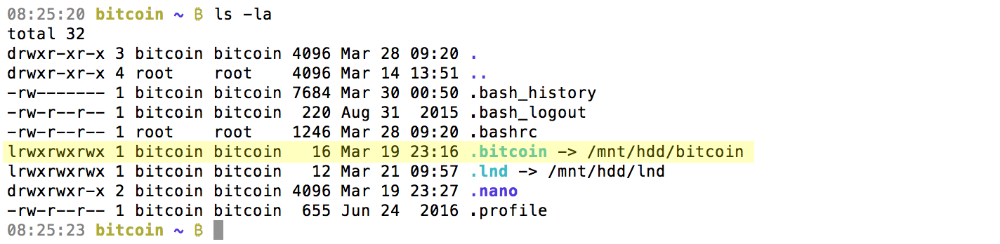

[ [Intro](README.md) ]--[ [Hardware](thundroid_01_hardware.md) ]--[ [Network](thundroid_02_network.md) ]--[ [Odroid](thundroid_03_odroid.md) ]--[ [Bash](thundroid_04_bash.md) ]--[ **Bitcoin** ]--[ [Lightning](thundroid_06_lnd.md) ]--[ [Tor](thundroid_07_tor.md) ]--[ [Web Interface](thundroid_08_webinterface.md) ]--[ [Contact](thundroid_09_contact.md) ]

--------
### Jarosz's Expanded :zap:Thundroid:zap: Guide
--------

The foundation of the Lightning node is a fully trustless Bitcoin Core node. It keeps a complete copy of the blockchain and validates all transactions and blocks. By doing this ourselves, nobody else needs to be trusted.

Note: LND has it's own wallet system; it does not use Bitcoin Core's (bitcoind's) wallet. So we will install Bitcoin Core (bitcoind) without a wallet.


# Install/Update Bitcoin Core 
As *admin* user:

* Create a downloads directory (if you haven't already).<br/>
  `mkdir /home/admin/downloads`
* Enter the downloads directory.<br/>
  `cd /home/admin/downloads`

### Get download links
Get download links for Bitcoin Core directly from https://bitcoin.org/en/download

* Right-click > Copy Link Address on "ARM Linux".
```
https://bitcoin.org/bin/bitcoin-core-0.17.0.1/bitcoin-0.17.0.1-arm-linux-gnueabihf.tar.gz
```
* Right-click > Copy Link Address on "Verify release signatures".
```
https://bitcoin.org/bin/bitcoin-core-0.17.0.1/SHA256SUMS.asc
```
* Right-click > Copy Link Address on "Release Signing Keys" > "v0.11.0+".
```
https://bitcoin.org/laanwj-releases.asc
```

### Import Signing Keys
You can skip this section if you're just updating and the signing keys haven't changed for the newest version.

* Download signing keys.<br/>
  `wget https://bitcoin.org/laanwj-releases.asc`
* Manually check the fingerprint of the public key:<br/>
  `gpg --with-fingerprint ./laanwj-releases.asc`
* Expected output:
```
01EA 5486 DE18 A882 D4C2  6845 90C8 019E 36C2 E964
```
* Import the public key of **Wladimir van der Laan**.<br/>
  `gpg --import ./laanwj-releases.asc`

### Download, verify, and install

* Remove old checksums (if updating).<br/>
  `rm SHA256SUMS.asc`

* Download the latest Bitcoin Core ARM binaries using the links found directly from [bitcoin.org](https://bitcoin.org/en/download).<br/>
  `wget https://bitcoin.org/bin/bitcoin-core-0.17.0.1/bitcoin-0.17.0.1-arm-linux-gnueabihf.tar.gz`<br/>
  `wget https://bitcoin.org/bin/bitcoin-core-0.17.0.1/SHA256SUMS.asc`

* Check that the reference checksum matches the real checksum. This is a precaution to make sure that this is an official release and not a malicious version trying to steal our money.<br/>
  `sha256sum --check SHA256SUMS.asc --ignore-missing`
* Expected output:
```
bitcoin-0.17.0.1-arm-linux-gnueabihf.tar.gz: OK
```

* Verify the signed checksum file and check the fingerprint again in case of malicious keys.<br/>
  `gpg --verify SHA256SUMS.asc`
* Expected outputs:
```
gpg: Good signature from Wladimir
Primary key fingerprint: 01EA 5486 DE18 A882 D4C2 6845 90C8 019E 36C2 E964
```

* Extract the Bitcoin Core binaries.<br/>
  `tar -xvf bitcoin-0.17.0.1-arm-linux-gnueabihf.tar.gz`
  * `tar` is used to extract archives
  * `-x` = extract 
  * `-v` = verbosely list files processed
  * `-f` = use a file (the file you are uncompressing)

* Install the Bitcoin Core binaries.<br/>
  `sudo install -m 0755 -o root -g root -t /usr/local/bin bitcoin-0.17.0/bin/*`
* Check the active version of Bitcoin Core binaries.<br/>
  `bitcoind -version`
* You should see:
```
Bitcoin Core Daemon version v0.17.0.1
```

### Stay up-to-date
Be sure to get notified of any new [Bitcoin Core releases](https://bitcoin.org/en/version-history).

There are many ways you can do this. I personally use [IFTTT](https://ifttt.com/discover) to automatically keep an eye on Bitcoin Core's RSS feed and then have IFTTT email me if/when there are any new releases.

My IFTTT Applet setup:

* If New feed item from https://bitcoin.org/en/rss/releases.rss, then Send me an email at example@example.com


# Initial Setup
You only have to do this once.

### Prepare Bitcoin Directory on External HDD/SSD

* Open session with *bitcoin* user.<br/>
  `sudo su bitcoin`

* Create a `bitcoin` folder on your external HDD/SSD for storing the blockchain.<br/>
  `mkdir /mnt/hdd/bitcoin`

* Link the `bitcoin` folder to a shortcut on the MicroSD card.<br/>
  `ln -s /mnt/hdd/bitcoin /home/bitcoin/.bitcoin`
  * `/home/bitcoin/` is the directory of the *bitcoin* user we created.
  * `.bitcoin` is the directory of Bitcoin Core (bitcoind).

* Return to *bitcoin*'s home directory.<br/>
  `cd`

* Check the link.<br/>
  `ls -la`



### Configuration

As *bitcoin* user:

* Create the configuration file for bitcoind.<br/>
  `nano /home/bitcoin/.bitcoin/bitcoin.conf`
* Paste the configuration below and replace PASSWORD_[C] with your password.

```
# Thundroid: bitcoind configuration
# /home/bitcoin/.bitcoin/bitcoin.conf

# Bitcoind options
server=1
daemon=1
txindex=1
disablewallet=1  # LND doesn't require the Bitcoin Core wallet.
#testnet=1       # Comment out to enable Bitcoin mainnet.

# Connection settings
rpcuser=bitcoin 
rpcpassword=PASSWORD_[C]
zmqpubrawblock=tcp://127.0.0.1:28332 
zmqpubrawtx=tcp://127.0.0.1:28333     # With LND, ZMQ ports cannot be the same!

# Optimizations for limited hardware
dbcache=100
maxorphantx=10
maxmempool=50
maxconnections=40
maxuploadtarget=5000
```

* Save & close the file. (Ctrl+X)

Note: it may take a few minutes for your Bitcoin node to re-sync after changing this configuration file.

### Auto-start bitcoind

* Exit *bitcoin* user session and return to *admin* user.<br/>
  `exit` (or Ctrl+D)

As *admin* user:

* Create the configuration file for bitcoind.service.<br/>
  `sudo nano /etc/systemd/system/bitcoind.service`
* Paste the configuration below:

```
# Thundroid: systemd unit for bitcoind
# /etc/systemd/system/bitcoind.service

[Unit]
Description=Bitcoin daemon
After=network.target

[Service]
# ExecStart creates /run/bitcoind owned by bitcoin
ExecStart=/usr/local/bin/bitcoind -daemon -conf=/home/bitcoin/.bitcoin/bitcoin.conf -pid=/run/bitcoind/bitcoind.pid
PIDFile=/run/bitcoind/bitcoind.pid
RuntimeDirectory=bitcoind
User=bitcoin
Group=bitcoin
Type=forking
Restart=on-failure

#####################
# HARDENING MEASURES

# Provide a private /tmp and /var/tmp.
PrivateTmp=true

# Mount /usr, /boot/ and /etc read-only for the process.
ProtectSystem=full

# Disallow the process and all of its children to gain
# new privileges through execve().
NoNewPrivileges=true

# Use a new /dev namespace only populated with API pseudo devices
# such as /dev/null, /dev/zero and /dev/random.
PrivateDevices=true

# Deny the creation of writable and executable memory mappings.
MemoryDenyWriteExecute=true

[Install]
WantedBy=multi-user.target
```

* Save & close the file. (Ctrl+X)

* Enable the configuration file and start it manually.<br/>
  `sudo systemctl enable bitcoind.service`
  `sudo systemctl start bitcoind.service`

* Copy `bitcoin.conf` to *admin* user's home directory for RPC credentials.<br/>
  `sudo cp /home/bitcoin/.bitcoin/bitcoin.conf /home/admin/.bitcoin/`

* Make *admin* user the owner of the copied file.<br/>
  `sudo chown admin:admin /home/admin/.bitcoin/bitcoin.conf`

* Restart your Thundroid.<br/>
  `sudo shutdown -r now`


# Check if it's working

### Verify Bitcoind Operations
After rebooting, bitcoind should start and begin to sync and validate the Bitcoin blockchain.<br/>

* Wait a bit, then reconnect via SSH as *admin* user (as always).

* Open session with *bitcoin* user.<br/>
  `sudo su bitcoin`

* Check the status of the bitcoin daemon that was started by systemd.<br/>
  `systemctl status bitcoind` 
* Exit with Ctrl+C.

* See bitcoind in action by monitoring its log file.<br/>
  `tail -f /home/bitcoin/.bitcoin/debug.log` (mainnet)<br/>
  `tail -f /home/bitcoin/.bitcoin/testnet3/debug.log` (testnet)
* Exit with Ctrl+C.

* Use the Bitcoin Core client `bitcoin-cli` to get information about the current blockchain and its verification (download) progress.<br/>
  `bitcoin-cli getblockchaininfo`
  * NOTE: Only *bitcoin* user can use `bitcoin-cli`.
  * Once the “verificationprogress” value reaches almost 1 (0.999…), the blockchain is up-to-date and fully validated.

### Verify Public Visiblility
Now that your Bitcoin node is running, let's check if the public can actually see and connect to it.

* Check public visibility.<br/>
  `curl -sL https://bitnodes.earn.com/api/v1/nodes/me-8333/ | jq` (mainnet)<br/>
  `curl -sL https://bitnodes.earn.com/api/v1/nodes/me-18333/ | jq` (testnet)
* Expected output:
```
{
  "success": true
}
```
* If you are getting a `false` result: 
  * Go back to the [Network](thundroid_02_network.md) section and make sure your router has port forwarding properly configured.
  * Go back to the [Odroid](thundroid_03_odroid.md) section and make sure your Uncomplicated FireWall (UFW) has the right rules in place.


# Explore bitcoin-cli
If everything is running smoothly, this is the perfect time to familiarize yourself with Bitcoin Core and play around with `bitcoin-cli` until the blockchain is up-to-date.

* A great point to start is **Mastering Bitcoin** by Andreas Antonopoulos - especially chapter 3 (ignore the first part how to compile from source code):
  * [Official Hardcopy (paid)](https://bitcoinbook.info/)
  * [Official PDF (free)](https://conferences.oreilly.com/oscon/oscon-or/public/content/mastering-bitcoin-second-edition)
  * [Official Github (free)](https://github.com/bitcoinbook/bitcoinbook)

* For a thorough deep dive, check out [Learning Bitcoin from the Command Line](https://github.com/ChristopherA/Learning-Bitcoin-from-the-Command-Line/blob/master/README.md) by Christopher Allen.

* Additional information: [bitcoin-cli reference](https://en.bitcoin.it/wiki/Original_Bitcoin_client/API_calls_list)

<hr/>

Once the Bitcoin blockchain is synced on your node, [Lightning can be set up](thundroid_06_lnd.md).