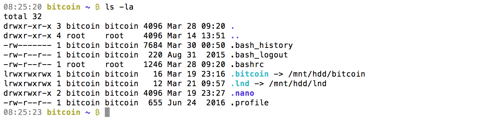

[ [Intro](README.md) ]--[ [Hardware](thundroid_01_hardware.md) ]--[ [Network](thundroid_02_network.md) ]--[ [Odroid](thundroid_03_odroid.md) ]--[ [Bash](thundroid_04_bash.md) ]--[ [Bitcoin](thundroid_05_bitcoin.md) ]--[ **Lightning** ]--[ [Tor](thundroid_07_tor.md) ]--[ [Web Interface](thundroid_08_webinterface.md) ]--[ [Contact](thundroid_09_contact.md) ]

--------
### Jarosz's Expanded :zap:Thundroid:zap: Guide
--------

There are three implementations of Lightning: 

* [LND](https://github.com/lightningnetwork/lnd) (by [Lightning Labs](https://lightning.engineering/))
* [c-lightning](https://github.com/ElementsProject/lightning) (by [Blockstream](https://blockstream.com/))
* [eclair](https://github.com/ACINQ/eclair) (by [ACINQ](https://acinq.co/))

We will be using the **LND** implementation.

The other two implementations can also be installed, but **only one implementation should run at any given time**.

# Install/Update Go
LND is written in Go (a programming language). So in order to work with LND, we need to install build dependencies for Go and dep. 

Note: The minimum version of Go for LND is version 1.9, so you do not necessary have to update Go every time a new version is released.

As *admin* user:

* Make sure that older versions of Go are removed from your system.<br/>
  `sudo rm -rf /usr/local/go/`

* Switch into your `downloads` directory.<br/>
  `cd /home/admin/downloads`

* Get the download link for the latest stable version of Go for Linux ARMv6: https://golang.org/dl/

* Download Go.<br/>
  `wget https://dl.google.com/go/go1.11.1.linux-armv6l.tar.gz`

* Extract the downloaded Go archive into our `/usr/local` directory.<br/>
  `sudo tar -C /usr/local -xzf go1.11.1.linux-armv6l.tar.gz`
  * `tar` is used to extract archives
  * `-C` = change directory (so the package content will be unpacked there)
  * `-x` = extract 
  * `-z` = gzipped archive
  * `-f` = use a file (the file you are uncompressing)

* Check the active version of Go binaries.
  `go version`

* You should see:
```
go version go1.11.1 linux/arm
```

### Go Initial Setup
You only have to do this once. You do NOT have to repeat this for updates.

* Open *admin*'s .bashrc file in Nano editor.<br/>
  `nano /home/admin/.bashrc`

* Paste both export statements at the end of `.bashrc`.
  * GOPATH represents the path to your workspace.
  * Adding $GOPATH/bin to your PATH ensures that your shell will be able to detect the binaries you install.

```
export GOPATH=/home/admin/go
export PATH=$PATH:/usr/local/go/bin:$GOPATH/bin
```

* Save & close the file. (Ctrl+X)

* Reload *admin*'s `.bashrc`.<br/>
  `source /home/admin/.bashrc`


# Install LND

As *admin* user:

* Download LND.<br/>
  `go get -d github.com/lightningnetwork/lnd`

* Download "dep" package manager for Golang.<br/>
  `go get -u github.com/golang/dep/cmd/dep`

* Change into the LND download directory.<br/>
  `cd $GOPATH/src/github.com/lightningnetwork/lnd`

* Build and then install LND and dep.<br/>
  `make && make install`

* Switch directories.<br/>
  `cd $GOPATH/bin`

* Copy `lnd` and `lncli` files to `/usr/local/bin/` directory.<br/>
  `sudo cp lnd lncli /usr/local/bin/`


# LND Initial Setup
You only have to do this once. You do NOT have to repeat this for updates.

### Prepare LND Directory on External HDD/SSD

* Open session with *bitcoin* user.<br/>
  `sudo su bitcoin`

* Create a `lnd` folder on your external HDD/SSD.<br/>
  `mkdir /mnt/hdd/lnd`

* Link the `lnd` folder to a shortcut on the MicroSD card.<br/>
  `ln -s /mnt/hdd/lnd /home/bitcoin/.lnd`

* Return to *bitcoin*'s home directory.<br/>
  `cd`

* Check the link.<br/>
  `ls -la`




### LND Configuration
Now that LND is installed, we need to configure it to work with Bitcoin Core and run automatically on startup.

As *bitcoin* user:

* Create the configuration file for LND.<br/>
  `nano /home/bitcoin/.lnd/lnd.conf`

* Paste the following configuration AND edit the `alias` (your node's public name) and customize your node's color.

```
# Thundroid: lnd configuration
# /home/bitcoin/.lnd/lnd.conf

[Application Options]
debuglevel=debug
maxpendingchannels=5
alias=YOUR_NODE_NAME  # EDIT!
color=#000000         # EDIT!

[Bitcoin]
bitcoin.active=1
bitcoin.node=bitcoind

# enable either testnet or mainnet
#bitcoin.testnet=1
bitcoin.mainnet=1

[autopilot]
#autopilot.active=1
#autopilot.maxchannels=5
#autopilot.allocation=0.6
```

* Note: we are jumping straight into **mainnet** with this configuration.

* Save & close the file. (Ctrl+X)

* Exit *bitcoin* user session and go back to *admin* user.<br/>
  `exit` (or Ctrl+D)

As *admin* user:

* Create LND systemd unit.<br/>
  `sudo nano /etc/systemd/system/lnd.service`

* Paste the following settings:

```
# Thundroid: systemd unit for lnd
# /etc/systemd/system/lnd.service

[Unit]
Description=LND Lightning Daemon
Wants=bitcoind.service
After=bitcoind.service

[Service]
ExecStart=/usr/local/bin/lnd
PIDFile=/home/bitcoin/.lnd/lnd.pid
User=bitcoin
Group=bitcoin
LimitNOFILE=128000
Type=simple
KillMode=process
TimeoutSec=180
Restart=always
RestartSec=60

[Install]
WantedBy=multi-user.target
```

* Save & close the file. (Ctrl+X)

* Enable and start LND.<br/>
  `sudo systemctl enable lnd`<br/>
  `sudo systemctl start lnd`<br/>
  `systemctl status lnd`

* Monitor the LND logfile in real-time.<br/>
  `sudo journalctl -f -u lnd` (exit with Ctrl+C)


# LND Wallet Setup
Once LND is started, it waits for us to create the integrated Bitcoin wallet (it does not use the bitcoind wallet, which is why we didn't create one during Bitcoin Core installation).

Note: for security reasons, only our *bitcoin* user can interact with bitcoind and lnd.

* Switch to *bitcoin* user.<br/>
  `sudo su bitcoin`

* Create the LND wallet (first time starting LND).<br/>
  `lncli create`

* Enter password [D] as wallet password.
* Select `n` (no) regarding an existing seed.
* Enter optional password [E] as seed passphrase. 
* A new cipher seed consisting of 24 words will be created.
  * These 24 words, combined with your passphrase (optional) is all that you need to restore your Bitcoin LND wallet and all Lighting channels. 
  * The current state of your channels, however, cannot be recreated from this seed, this requires a continuous backup and is still under development for LND.

⚠️ Your 24 word seed must be kept secret at all times. Write these 24 words down manually on a piece of paper and store it in a safe place. This piece of paper is all an attacker needs to completely empty your wallet! Do not store it on a computer. Do not take a picture with your mobile phone. This information should never be stored anywhere in digital form.


### Assign LND permissions to *admin* (optional)
If you want *admin* user to be able to run `lncli` commands, you'll need to do the following:

* Make sure permission files `admin.macaroon` and `readonly.macaroon` have been created.<br/>
  `ls -la /home/bitcoin/.lnd/`

* Create an LND directory for *admin* user.<br/>
  `mkdir /home/admin/.lnd`

* Copy permission files to *admin* user.<br/>
  `sudo cp /home/bitcoin/.lnd/admin.macaroon /home/admin/.lnd`

* Copy TLS cert to *admin* user.<br/>
  `sudo cp /home/bitcoin/.lnd/tls.cert /home/admin/.lnd`

* Make *admin* user the owner of the `/home/admin/.lnd/` directory and all files inside of it (`-R`).<br/>
  `sudo chown -R admin:admin /home/admin/.lnd/`

* Make sure that lncli works by unlocking your wallet and getting some node information.
  `lncli unlock`<br/>
  `sudo journalctl -f -u lnd`


# Using LND

* Unlock your LND wallet.<br/>
  `lncli unlock`

* Generate a new Bitcoin address to receive funds on-chain.<br/>
  `lncli newaddress np2wkh`

* Check your LND wallet balance.<br/>
  `lncli walletbalance`

### Buying Blockstream's Lightning Sticker (optional)

We are going to put our mainnet node to use by buying Blockstream's [I Got Lightning Working](https://store.blockstream.com/product/lightning-sticker/) sticker. This sticker can only be purchased using Lightning.


* Look up Blockstream's node.<br/>
  `lncli getnodeinfo 02f6725f9c1c40333b67faea92fd211c183050f28df32cac3f9d69685fe9665432`
```
{
    "node": {
        "last_update": 1523581461,
        "pub_key": "02f6725f9c1c40333b67faea92fd211c183050f28df32cac3f9d69685fe9665432",
        "alias": "SLEEPYARK-th-local-modifications",
        "addresses": [
            {
                "network": "tcp",
                "addr": "104.198.32.198:9735"
            }
        ],
        "color": "#02f672"
    },
    "num_channels": 147,
    "total_capacity": "43592004"
}
```

* Connect to Blockstream's node.<br/>
  `lncli connect 02f6725f9c1c40333b67faea92fd211c183050f28df32cac3f9d69685fe9665432@104.198.32.198:9735`

* Make sure the connetion worked and it's listed as your peer.<br/>
  `lncli listpeers`

* Open a channel with Blockstream's node. Replace `amount_in_satoshis` with the number of satoshis you plan to spend at Blockstream's store PLUS a bit extra (see below for the reason why). I used `110000` satoshis, which is 0.0011 XBT or roughly 10 USD. The minimum channel size is `20000` satoshis or 0.0002 XBT.<br/>
  `lncli openchannel 02f6725f9c1c40333b67faea92fd211c183050f28df32cac3f9d69685fe9665432 amount_in_satoshis`

---

IMPORTANT: Opening a Lightning channel requires creating a transaction on Bitcoin's blockchain, so you'll lose some of your satoshis to miner fees. Closing the channel requires a second transaction on Bitcoin's blockchain, and you'll again lose some of your satoshis to miner fees.

So you need to fund your channel with more satoshis than the amount of your invoice from Blockstream. This is because a portion of the channel balance will be held as a "commit fee" to pay for the miner fees needed to close the channel in the future.

Also, your channel amount has to be less than the size your Lightning wallet balance. This is because **opening** miner fees are taken from your wallet balance outside of your channel amount, whereas **closing** miner fees are taken from the channel amount itself.

*For example: to open a 110,000 satoshi channel, I needed 113,130 satoshis in my Lightning wallet because 3,130 satoshis went for opening fees. Also, of the 110,000 satoshi channel amount, 3,620 satoshi were held for the "commit fee". When I finally closed the channel with Blockstream, the closing fee was just 1,295 satoshi, so I was returned 2,325 satoshi of the commit fee.*

---

* View the blockchain transaction used to open your channel.<br/>
  `lncli listchaintxns`
```
{
    "tx_hash": "fa9d363061f3dee7ab5fa4bd343b0d6d78ab95e4b74fd6bd83cd82cc57fedee0",
    "amount": "-113130",
    "num_confirmations": 15,
    "block_hash": "00000000000000000017d0cbb4a43bf066f28ad8edea457cea4aba7b5c0b9572",
    "block_height": 517930,
    "time_stamp": "1523578457",
    "total_fees": "3130",
    "dest_addresses": [
        "bc1qgkkz5yv0s942yaf07mwth3d9hfgd9e9yt470ze",
        "bc1qsg6c3353gx5ens2cfc2wyxn4cyv2dajt64fr0gye4h2w5yfceguqee37za"
    ]
}
```

* View how many Pending and Active channels you have. You need to wait about 10 minutes or so for the new channel to go from "Pending" to "Active".<br/>
  `lncli getinfo`

* View your Active channels. Note: 3620 satoshi are unusable due to them being used as a "commit fee". This is to ensure the channel has enough money to pay for the required miner fees to close the channel on the blockchain. You may get a portion of these fees back if the miner fee is cheaper when the channel is closed.<br/>
  `lncli listchannels`
```
{
    "channels": [
        {
            "active": true,
            "remote_pubkey": "02f6725f9c1c40333b67faea92fd211c183050f28df32cac3f9d69685fe9665432",
            "channel_point": "fa9d363061f3dee7ab5fa4bd343b0d6d78ab95e4b74fd6bd83cd82cc57fedee0:1",
            "chan_id": "569470057432809473",
            "capacity": "110000",
            "local_balance": "106380",
            "remote_balance": "0",
            "commit_fee": "3620",
            "commit_weight": "600",
            "fee_per_kw": "5000",
            "unsettled_balance": "0",
            "total_satoshis_sent": "0",
            "total_satoshis_received": "0",
            "num_updates": "0",
            "pending_htlcs": [
            ],
            "csv_delay": 144,
            "private": false
        }
    ]
}
```

* View the fees associated with your open channels.<br/>
  `lncli feereport`
```
{
    "channel_fees": [
        {
            "channel_point": "fa9d363061f3dee7ab5fa4bd343b0d6d78ab95e4b74fd6bd83cd82cc57fedee0:1",
            "base_fee_msat": "1000",
            "fee_per_mil": "1",
            "fee_rate": 0.000001
        }
    ],
    "day_fee_sum": "0",
    "week_fee_sum": "0",
    "month_fee_sum": "0"
}
```

* Once your channel with Blockstream is active, you can go to their [store](https://store.blockstream.com/product/lightning-sticker/), order the sticker(s) you want, and then get a Lightning payment invoice code.

* Check the details of the invoice from Blockstream. Replace `bolt11_string` with the invoice code they give you.<br/>
  `lncli decodepayreq bolt11_string`

* You'll see a result similar to this:

```
lncli decodepayreq lnbc893976910p1pddqr0spp54pswvfqxmhnqh3hzxpy264a3u8uj6eqaa60t5w2k04emvasz8gkqdz6gfkx7cmtwd68yetpd5s9xar0wfjn5gpk9cunsgz42dzzqen0ypskuepqf35kw6r5de5kueeq2d6xjcmtv4ezq7pqxgcqpg90zsmxcaj5hct62yj7t7zyszredrz7shs8lkmpqql5kv0qxceyentxp5yk934l2m5eldwhkuemd86lgf0q06gu62yjql7qc3v6rzkespu0nhzh

{
    "destination": "02f6725f9c1c40333b67faea92fd211c183050f28df32cac3f9d69685fe9665432",
    "payment_hash": "a860e62406dde60bc6e23048ad57b1e1f92d641dee9eba39567d73b676023a2c",
    "num_satoshis": "89397",
    "timestamp": "1523584496",
    "expiry": "3600",
    "description": "Blockstream Store: 6.98 USD fo and Lightning Sticker x 2",
    "description_hash": "",
    "fallback_addr": "",
    "cltv_expiry": "8"
}
```

* If everything looks good, go ahead and pay for the invoice. Again, remember to replace `bolt11_string` with your own unique invoice code.<br/>
  `lncli payinvoice bolt11_string`
```
{
	"payment_error": "",
	"payment_preimage": "b4778be8fa4f748ad4ae16e104e4534d634101e5fb8f160c75adccbc35e4e4ab",
	"payment_route": {
		"total_time_lock": 517951,
		"total_amt": 89397,
		"hops": [
			{
				"chan_id": 569470057432809473,
				"chan_capacity": 110000,
				"amt_to_forward": 89397,
				"expiry": 517951
			}
		]
	}
}
```

* The payment should now be added to your history of payments.<br/>
  `lncli listpayments`
```
{
    "payments": [
        {
            "payment_hash": "a860e62406dde60bc6e23048ad57b1e1f92d641dee9eba39567d73b676023a2c",
            "value": "89397",
            "creation_date": "1523584560",
            "path": [
                "02f6725f9c1c40333b67faea92fd211c183050f28df32cac3f9d69685fe9665432"
            ],
            "fee": "0",
            "payment_preimage": "b4778be8fa4f748ad4ae16e104e4534d634101e5fb8f160c75adccbc35e4e4ab"
        }
    ]
}
```

* View your open channel with Blockstream again. Note how satoshis have shifted from `local_balance` to `remote_balance`.<br/>
  `lncli listchannels`
```
{
    "channels": [
        {
            "active": true,
            "remote_pubkey": "02f6725f9c1c40333b67faea92fd211c183050f28df32cac3f9d69685fe9665432",
            "channel_point": "fa9d363061f3dee7ab5fa4bd343b0d6d78ab95e4b74fd6bd83cd82cc57fedee0:1",
            "chan_id": "569470057432809473",
            "capacity": "110000",
            "local_balance": "16982",
            "remote_balance": "89397",
            "commit_fee": "3621",
            "commit_weight": "724",
            "fee_per_kw": "5000",
            "unsettled_balance": "0",
            "total_satoshis_sent": "89397",
            "total_satoshis_received": "0",
            "num_updates": "2",
            "pending_htlcs": [
            ],
            "csv_delay": 144,
            "private": false
        }
    ]
}
```

* View the blockchain transaction for closing your channel. Note how my channel was opened for 110,000 satoshi, my invoice was 89,397, and I got back 19,308 satoshi when closing the channel. This leaves a difference of 1,295 satoshi lost to miner fees for closing the channel (on top of the 3,130 satoshi spent earlier to open the channel).<br/>
  `lncli listchaintxns`
```
{
    "tx_hash": "a7e3b39eea623bdcee73dc6983e93b60615e890344be878260c92676ea20e952",
    "amount": "19308",
    "num_confirmations": 1573,
    "block_hash": "000000000000000000246ebe13e80be1edb94137d34d82c0913348b3897a7036",
    "block_height": 518747,
    "time_stamp": "1524037544",
    "total_fees": "0",
    "dest_addresses": [
        "bc1qnh3cverwffxepphcnk3xqg8ex92cklha5flkhs"
    ]
}
```

Note: if you already have open channels with other nodes, there's a chance you're indirectly connected to Blockstream's node. You can check by running this command: (replace `invoice_amt_in_satoshi` with the value of your invoice)<br/>
  `lncli queryroutes 02f6725f9c1c40333b67faea92fd211c183050f28df32cac3f9d69685fe9665432 invoice_amt_in_satoshi`

* If there are no indirect connections OR if they are not big enough to support your `invoice_amt_in_satoshi` value, you'll see a message like this:
```
[lncli] rpc error: code = Unknown desc = unable to find a path to destination
```

* If you are indirectly (or directly) connected to Blockstream's node AND the capacities are big enough to support your `invoice_amt_in_satoshi` value, you'll see a message like this:
```
lncli queryroutes 02f6725f9c1c40333b67faea92fd211c183050f28df32cac3f9d69685fe9665432 89397
{
    "routes": [
        {
            "total_time_lock": 517952,
            "total_fees": "0",
            "total_amt": "89397",
            "hops": [
                {
                    "chan_id": "569470057432809473",
                    "chan_capacity": "110000",
                    "amt_to_forward": "89397",
                    "fee": "0",
                    "expiry": 517952
                }
            ]
        }
    ]
}
```

* Note: always check the fee amounts, because some channels/nodes will charge you for going through them to pay someone else.


# Update LND

As *admin* user:

* Check your LND's version.<br/>
  `lncli -v`

* Stop Lightning services.<br/>
  `sudo systemctl stop lnd`

* Change into the LND download directory.<br/>
  `cd $GOPATH/src/github.com/lightningnetwork/lnd`

* Check for updates.<br/>
  `git pull`

* Build and then install LND.<br/>
  `make clean && make && make install`

* Switch directories.<br/>
  `cd $GOPATH/bin`

* Copy `lnd` and `lncli` files to `/usr/local/bin/` directory.<br/>
  `sudo cp lnd lncli /usr/local/bin/`

* Check your LND's version.<br/>
  `lncli -v`

* Start Lightning services.<br/>
  `sudo systemctl start lnd`


# Switching Between Mainnet & Testnet
Follow these instructions if you want to switch between mainnet and testnet.

* As *admin* user, stop the Bitcoin and Lightning services.<br/>
  `sudo systemctl stop lnd`<br/>
  `sudo systemctl stop bitcoind`

* Edit the `bitcoin.conf` file.<br/>
  `sudo nano /home/bitcoin/.bitcoin/bitcoin.conf`
```
# Comment-out the following line to enable Bitcoin mainnet.
# (or un-comment it to enable Bitcoin testnet)
#testnet=1
```

* Save & close the file. (Ctrl+X)

* Edit the `lnd.conf` file.<br/>
  `sudo nano /home/bitcoin/.lnd/lnd.conf`
```
# enable either testnet or mainnet
#bitcoin.testnet=1
bitcoin.mainnet=1
```

* Save & close the file. (Ctrl+X)

* Currently when switching between testnet and mainnet on LND, you need to manually wipe all macaroon db files so new ones can be generated. If you skip this step, your LND wallet will have errors and not work.<br/>
  `sudo su bitcoin`<br/>
  `cd /home/bitcoin/.lnd/`<br/>
  `rm admin.macaroon`<br/>
  `rm readonly.macaroon`<br/>
  `cd data`<br/>
  `rm macaroons.db`

* Restart your node.<br/>
  `sudo shutdown -r now`

* Start Bitcoind and check if it's operating on the net you want.<br/>
  `sudo systemctl start bitcoind`<br/>
  `systemctl status bitcoind.service`<br/>
  `sudo su bitcoin`<br/>
  `tail -f /home/bitcoin/.bitcoin/debug.log` (exit with Ctrl-C)<br/>
  `bitcoin-cli getblockchaininfo`<br/>
  `exit`

* Start LND and check its operation.<br/>
  `sudo systemctl start lnd`<br/>
  `systemctl status lnd`<br/>
  `sudo journalctl -f -u lnd`

* Restore your LND wallet or create a new one.<br/>
  `lncli create`

* Note: After the restart, your node will need to catchup with the new net's blockchain. This can take a few hours. In the meantime, you can...

* Monitor the system logs:<br/>
  `systemctl status lnd`

* Check the system load to see if your Thundroid is still working hard:<br/>
  `htop`