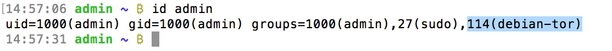
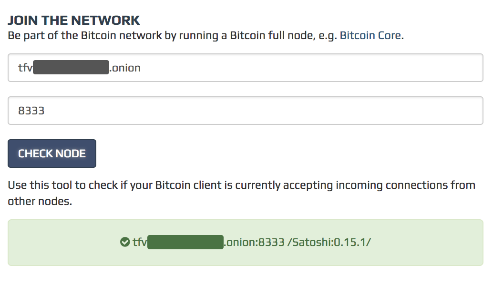
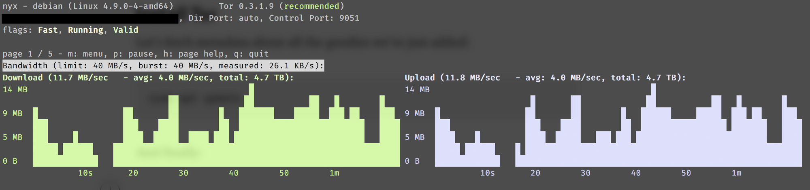

[ [Intro](README.md) ]--[ [Hardware](thundroid_01_hardware.md) ]--[ [Network](thundroid_02_network.md) ]--[ [Odroid](thundroid_03_odroid.md) ]--[ [Bash](thundroid_04_bash.md) ]--[ [Bitcoin](thundroid_05_bitcoin.md) ]--[ [Lightning](thundroid_06_lnd.md) ]--[ **Tor** ]--[ [Web Interface](thundroid_08_webinterface.md) ]--[ [Contact](thundroid_09_contact.md) ]

--------
### Jarosz's Expanded :zap:Thundroid:zap: Guide
--------

Tor is a service that helps users protect their anonymity while using the Internet. This is important for bitcoin users in countries where bitcoin is banned or viewed under suspicion by the government.

There are many other uses of Tor, including keeping websites from tracking you and your family members, using websites or services which are blocked in your country (for example, getting around the Great Firewall of China), and maintaining anonymity when communicating about socially sensitive information, such as health issues or whistleblowing. 

Tor software depends on the Tor network, which is made up of Tor relays operated by individuals and organizations all over the world. The more Tor relays that are running, the faster, more robust, and more secure the Tor network will be.

This is why I made my Bitcoin node accessible through the Tor network, and why I'm also running a Tor [**Middle Relay**](https://www.eff.org/torchallenge/what-is-tor.html). This guide will show you how you can do the same.

Please check your configuration carefully and also check the original article of Damian Mee for additional details.
https://medium.com/@meeDamian/bitcoin-through-tor-on-rbp3-12d38a1506f


## Installing Tor

* Before starting, make sure your system is up to date.<br/>
  `sudo apt update`<br/>
  `sudo apt full-upgrade`

* Check your debian version. This guide was written for **stretch**, so if your version is different then please proceed with extra care.<br/>
  `lsb_release -c`

* As part of its operation, `apt` uses a file that lists the 'sources' from which packages can be obtained.<br/>
  `sudo nano /etc/apt/sources.list`

* Add the Tor repository to `apt` by adding the following lines to **sources.list**:

```
deb https://deb.torproject.org/torproject.org xenial main
deb-src https://deb.torproject.org/torproject.org xenial main
```

* Save & close the file. (Ctrl+X)

* Install dirmngr, which is a server for managing and downloading OpenPGP and X.509 certificates. Dirmngr is used for network access by gpg, gpgsm, and dirmngr-client, among other tools. Unless this package is installed, the parts of the GnuPG suite that try to interact with the network will fail.<br/>
  `sudo apt install dirmngr`

* Add the Tor signing key.<br/>
  `gpg --keyserver keys.gnupg.net --recv 886DDD89`<br/>
  `gpg --export A3C4F0F979CAA22CDBA8F512EE8CBC9E886DDD89 | sudo apt-key add -`

* Install Tor & Tor-arm. Tor-arm is not required, but it provides a useful tor dashboard, visualising what’s going on with your node.<br/>
  `sudo apt install tor tor-arm`


## Configuring Tor
Warning: Proper Tor configuration is VERY important. Misconfigured node can end up:
* using up all of your internet quota,
* having ISP suspending/terminating your internet contract,
* and, in some more draconian jurisdiction, with you in jail(!).

Make sure your Tor node is configured correctly and always up to date

* Open Tor's configuration file.<br/>
  `sudo nano /etc/tor/torrc`

* If you only want to make your Bitcoin node accessible through the Tor network, and NOT run a Middle Relay, then paste these settings:

```
RunAsDaemon 1
PortForwarding 1

ControlPort 9051
CookieAuthentication 1
CookieAuthFileGroupReadable 1

MaxMemInQueues 256MB

# To have Tor logs in a separate file:
Log notice file /var/log/tor/notices.log

# To have your Thundroid serve Bitcoin traffic only through Tor:
#onlynet=onion
```

* If you only want to make your Bitcoin node accessible through the Tor network AND run a Middle Relay, then paste these settings:

```
## Send all messages of level 'notice' or higher to /var/log/tor/notices.log
Log notice file /var/log/tor/notices.log

## To start the process in the background...
RunAsDaemon 1

## The port on which Tor will listen for local connections from Tor
## controller applications, as documented in control-spec.txt.
ControlPort 9051

## If you enable the controlport, be sure to enable one of these two
## authentication methods, to prevent attackers from accessing it.
#HashedControlPassword 16:872860B76453A77D60CA2BB8C1A7042072093276A3D701AD684053EC4C
CookieAuthentication 1

## OTHER SETTINGS FROM DAMIAN MEE's GUIDE
CookieAuthFileGroupReadable 1
PortForwarding 1
MaxMemInQueues 256MB

## TOR ARM
## Tor is preventing system utilities like netstat and lsof from working. 
## This means that arm can't provide you with connection information. 
## You can change this by adding 'DisableDebuggerAttachment 0' to your torrc.
DisableDebuggerAttachment 0


################ This section is just for relays #####################

## Do NOT allow your relay to be used as an Exit.
ExitPolicy reject *:* # no exits allowed

## Required: what port to advertise for incoming Tor connections.
ORPort 9001

## A handle for your relay, so people don't have to refer to it by key.
## Nicknames must be between 1 and 19 characters inclusive, 
## and must contain only the characters [a-zA-Z0-9].
Nickname YOUR-RELAY-NAME-HERE

## Administrative contact information for this relay or bridge. This line
## can be used to contact you if your relay or bridge is misconfigured or
## something else goes wrong. Note that we archive and publish all
## descriptors containing these lines and that Google indexes them, so
## spammers might also collect them. You may want to obscure the fact that
## it's an email address and/or generate a new address for this purpose.
#ContactInfo Random Person <nobody AT example dot com>

## You might also include your PGP or GPG fingerprint if you have one:
#ContactInfo 0xFFFFFFFF Random Person <nobody AT example dot com>


## Define these to limit how much relayed traffic you will allow. 
## Your own traffic is still unthrottled. 
## Note that RelayBandwidthRate must be at least 75 kilobytes per second.
## Note that units for these config options are bytes (per second), not bits (per second), 
## and that prefixes are binary prefixes, i.e. 2^10, 2^20, etc.
RelayBandwidthRate 100 KBytes  # Throttle traffic to 100KB/s (800Kbps)
RelayBandwidthBurst 200 KBytes # But allow bursts up to 200KB (1600Kb)

## Use these to restrict the maximum traffic per day, week, or month.
## Note that this threshold applies separately to sent and received bytes, not to their sum: 
## setting "40 GB" may allow up to 80 GB total before hibernating.

## Set a maximum of 40 gigabytes each way per period.
AccountingMax 50 GBytes

## Each period starts daily at midnight (AccountingMax is per day)
#AccountingStart day 00:00

## Each period starts on the 3rd of the month at 15:00 (AccountingMax is per month)
AccountingStart month 15 12:00


## Uncomment this to mirror directory information for others. 
## Please do if you have enough bandwidth.
#DirPort 9030 # what port to advertise for directory connections

## Uncomment to return an arbitrary blob of html on your DirPort. Now you
## can explain what Tor is if anybody wonders why your IP address is
## contacting them. See contrib/tor-exit-notice.html in Tor's source
## distribution for a sample.
#DirPortFrontPage /etc/tor/tor-exit-notice.html

```
* Save & close the configuration file. (Ctrl+X)

* Restart Tor.<br/>
  `sudo service tor@default restart`

* By default, Tor runs as debian-tor user and its access cookie is not accessible to our *admin* and *bitcoin* users. To change this, run:<br/>
  `sudo usermod -a -G debian-tor admin`<br/>
  `sudo usermod -a -G debian-tor bitcoin`

* Verify that it succeeded (make sure that debian-tor is in the output for each user).<br/>
  `id admin`<br/>
  `id bitcoin`



* Restart your Bitcoin node.<br/>
  `sudo su bitcoin`<br/>
  `bitcoin-cli stop`

* Wait until it fully terminates, then start it again.<br/>
  `bitcoind`


## Check Status
Your Bitcoin node should now automatically connect through Tor as well. The easiest way to verify the connection succeeded is by checking the logs.

* Check logs to see if Tor is recognized by bitcoind.<br/>
  `sudo cat /home/bitcoin/.bitcoin/debug.log | grep tor:` (mainnnet)<br/>
  `sudo cat /home/bitcoin/.bitcoin/testnet3/debug.log | grep tor:` (testnet)

* If everything is working well, this command will show you your node's .onion address.
  
You can also verify your Bitcoin node is publicly reachable via Tor by going to [bitnodes.earn.com](https://bitnodes.earn.com/) and pasting your .onion address there.



If you opted to run a **Middle Relay**, you can check its status using the `arm` command.




## Updating Tor
Be sure to check for updates on a regular basis (or automate the process).

* Check for updates.<br/>
  `sudo apt update`

* To update only Tor:<br/>
  `sudo apt install —only-upgrade tor`

* To update all packages (recommended):<br/>
  `sudo apt upgrade`

* Restart Tor.<br/>
  `sudo service tor@default restart`


## Uninstalling Tor
If you change your mind about running Tor, here's how you can remove it from Thundroid.

* To remove just tor & tor-arm packages:<br/>
  `sudo apt-get remove tor tor-arm`

* OR, to remove the tor & tor-arm packages AND any other dependant packages which are no longer needed:<br/>
  `sudo apt-get remove --auto-remove tor tor-arm`

* Remove the Tor repository from `apt` by removing *torproject.org* references from **sources.list**:<br/>
  `sudo nano /etc/apt/sources.list`

Optional: Purging

* To delete configuration and/or data files of tor & tor-arm:<br/>
  `sudo apt-get purge tor tor-arm`

* OR, to delete configuration and/or data files of tor & tor-arm AND their dependencies:<br/>
  `sudo apt-get purge --auto-remove tor tor-arm`